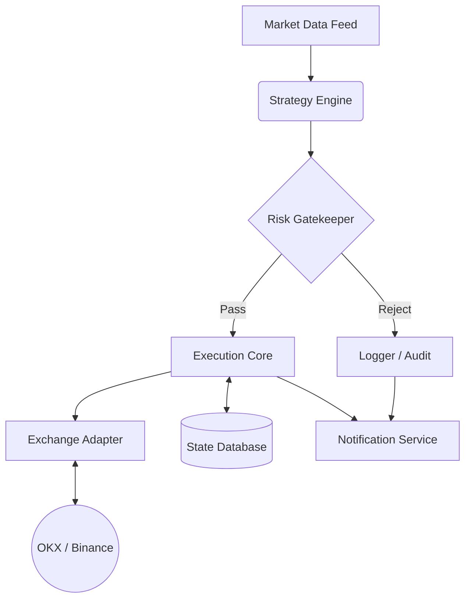

# Project 1.66: Momentum Engine (ETH Volatility Squeeze Bot)

## 1. 项目愿景 (Project Vision)
本项目旨在构建一个高可用、模块化的量化交易系统，专注于捕捉 **Ethereum (ETH)** 市场的“肥尾”效应（Fat-tail trends）。系统核心基于 **Volatility Squeeze (波动率挤压)** 策略，结合严格的 **1.66% 固定风险定额** 资金管理模型，实现“极小回撤、爆发增长”的非对称收益曲线。

**首发目标**：OKX 实盘（ETH/USDT 永续合约）
**未来扩展**：Binance 及多币种（SOL, AVAX）带单矩阵

---

## 2. 核心交易哲学 (Core Philosophy)

### 2.1 策略逻辑：The Squeeze (挤压与释放)
* **原理**：利用布林带 (Bollinger Bands) 与凯特纳通道 (Keltner Channels) 的相对位置，识别市场波动率极度压缩的“死寂期”。
* **信号 (Trigger)**：
    * **Squeeze On (蓄势)**：布林带完全收敛进凯特纳通道内部。
    * **Breakout (爆发)**：价格强势突破布林带上轨/下轨 + 成交量确认 + 动能指标 (Momentum) 共振。
* **出场**：不设固定止盈，使用动态追踪止损 (Trailing Stop) 吃尽趋势。

### 2.2 风控铁律：The 1.66% Rule
* **单笔风险定额**：任何一笔交易的账户最大本金亏损锁定为 **1.66%**。
* **动态仓位计算**：`仓位大小 = (账户总权益 * 1.66%) / (入场价 - 止损价)`。
* **盈亏比过滤**：预期盈亏比 (PnL Ratio) **< 1.5** 的交易机会，系统自动放弃。

---

## 3. 系统架构设计 (System Architecture)

系统采用 **六边形架构 (Hexagonal Architecture)** 思想，核心逻辑与外部依赖（交易所 API、数据库）解耦，确保未来从 OKX 迁移至 Binance 时只需替换适配器。

### 3.1 模块全景图


### 3.2 核心模块详解

#### A. Data Feed (数据馈送层)

* **职责**：抹平交易所差异，提供标准化的 OHLCV 数据流。
* **功能**：
* `DataFetcher`：通过 REST API 拉取历史 K 线（用于初始化指标）。
* `StreamListener`：通过 WebSocket 监听实时 Tick/K 线数据（用于毫秒级触发）。
* `Normalizer`：将原始 JSON 清洗为 Pandas DataFrame 格式。


#### B. Strategy Engine (策略大脑)

* **职责**：纯粹的数学计算，无状态，不涉及资金。
* **组件**：
* `IndicatorFactory`：计算 BB (20, 2.0), KC (20, 1.5), ATR (14), Momentum。
* `SignalDetector`：
* 检测 `Squeeze_On` 状态。
* 检测 `Breakout_Long` / `Breakout_Short` 信号。


* `TargetCalculator`：计算建议的 `Entry_Price`, `Hard_Stop_Loss` (基于结构或 ATR)。


#### C. Risk Gatekeeper (风控护城河)

* **职责**：执行“1.66% 铁律”，拦截不合格交易。**系统中最关键的模块。**
* **逻辑**：
* **PnL Check**：`(止盈位 - 入场位) / (入场位 - 止损位) >= 1.5` ? 通过 : 拒绝。
* **Size Calculator**：根据 `Risk_Amount (Total_Equity * 0.0166)` 反推仓位数量。
* **Kill Switch**：如果当日回撤 > 5% 或 API 错误率过高，物理熔断。


#### D. Execution Core (执行核心)

* **职责**：订单生命周期管理。
* **功能**：
* `OrderRouter`：根据信号类型选择市价单 (Market) 或限价单 (Limit)。
* `TrailingManager`：趋势启动后，每隔 N 秒检查价格，自动上移止损单 (Modify Order)。
* `StateGuard`：确保本地状态与交易所状态一致（处理掉单、网络超时）。


#### E. Exchange Adapter (交易所适配器)

* **职责**：基于 `ccxt` 封装的统一接口层。
* **接口定义**：
* `fetch_ohlcv()`
* `get_balance()`
* `create_order()`
* `modify_order()` (用于移动止损)


#### F. Notification & Storage (基础设施)

* **Storage**：使用 `SQLite` 或 `JSON` 文件记录 `trade_log.db`（交易流水）和 `app_state.json`（恢复现场用）。
* **Notify**：集成 Telegram Bot / 钉钉机器人，推送开仓、平仓、止盈、报错信息。

---

## 4. 工程目录结构 (Project Structure)

```text
Project_1.66_Momentum/
├── config/
│   ├── settings.yaml       # 全局配置 (交易所Key, 风险参数1.66%, 杠杆倍数)
│   └── strategies.yaml     # 策略参数 (BB长度, KC倍数, ATR周期)
├── data/
│   ├── db/                 # SQLite 数据库文件
│   └── logs/               # 运行日志
├── src/
│   ├── __init__.py
│   ├── data_feed/          # 数据接入模块
│   │   └── okx_loader.py
│   ├── strategy/           # 策略逻辑
│   │   ├── indicators.py   # TA-Lib 封装
│   │   └── squeeze.py      # 挤压策略核心逻辑
│   ├── risk/               # 风控模块
│   │   └── manager.py      # 1.66% 仓位计算与过滤
│   ├── execution/          # 交易执行
│   │   ├── adapter.py      # CCXT 封装
│   │   └── trader.py       # 订单管理与追踪止损
│   └── utils/              # 工具类 (日志, 推送)
├── main.py                 # 程序入口
├── backtest.py             # 回测脚本 (独立于实盘)
├── requirements.txt        # 依赖库 (ccxt, pandas, pandas_ta, numpy)
└── README.md               # 本文档

```

---

## 5. 开发路线图 (Roadmap)

### Phase 1: 原型与回测 (Backtesting)

* [ ] 搭建 Python 环境与数据拉取脚本 (OKX)。
* [ ] 实现 `strategy/squeeze.py`：计算 BB/KC 挤压信号。
* [ ] 实现 `risk/manager.py`：跑通 1.66% 仓位模拟。
* [ ] **产出**：ETH 过去 6 个月的向量化回测报告（胜率、盈亏比、最大回撤）。

### Phase 2: 模拟盘仿真 (Paper Trading)

* [ ] 接入 OKX 模拟盘 API。
* [ ] 开发 `execution/trader.py`：实现自动开仓、挂止损单。
* [ ] 调试 `Trailing Stop` (移动止损) 的灵敏度。
* [ ] **产出**：在模拟环境连续稳定运行 7 天无报错。

### Phase 3: 实盘上线 (Live Trading)

* [ ] 部署至云服务器 (AWS/Aliyun)。
* [ ] 配置 Telegram 实时报警。
* [ ] 注入小额资金 (100-500 USDT) 开启实盘。
* [ ] **目标**：实盘资金曲线开始稳步爬升。

---

## 6. 特别备注 (Notes)

* **Dependencies**: Python 3.9+, CCXT, Pandas, Pandas-TA.
* **Security**: API Key 必须通过环境变量或加密配置文件读取，严禁上传至 GitHub。

```

```